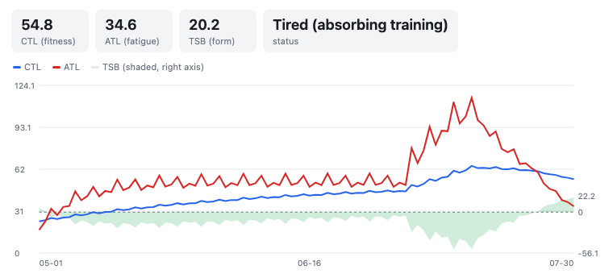

# TrainingPeaks MCP Server

<a href="https://glama.ai/mcp/servers/@JamsusMaximus/TrainingPeaks-MCP">
  
</a>

Connect TrainingPeaks to Claude and other AI assistants via the Model Context Protocol (MCP). Query workouts, build structured intervals, manage your calendar, track fitness trends, and control your training through natural conversation.

**No API approval required.** The official Training Peaks API is approval-gated, but this server uses secure cookie authentication that any user can set up in minutes. Your cookie is stored in your system keyring, never transmitted anywhere except to TrainingPeaks.

## What You Can Do


Ask your AI assistant things like:
- "Build me a 4x8min threshold session for Tuesday with warm-up and cool-down"
- "Schedule my mobility session for April 14, 2026 at 16:45"
- "Compare my FTP progression this year vs last year"
- "Copy last week's long ride to this Saturday"
- "Log my weight at 74.5kg and sleep at 7.5 hours"
- "What's my weekly TSS so far? Am I on track for my ATP target?"
- "Show my race calendar and how many weeks until my A race"
- "Set my FTP to 310 and update my power zones"
- "Add a calendar note for next Monday: rest day, travel"

## Tools (84)

### Workouts
| Tool | Description |
|------|-------------|
| `tp_get_workouts` | List workouts in a date range (max 90 days) |
| `tp_get_workout` | Get full details for a single workout |
| `tp_create_workout` | Create a workout with optional interval structure, auto-computed IF/TSS, and optional planned start time |
| `tp_update_workout` | Update any field of an existing workout, including structured intervals and planned start time |
| `tp_delete_workout` | Delete a workout |
| `tp_copy_workout` | Copy a workout to a new date (preserves structure and planned fields) |
| `tp_reorder_workouts` | Reorder workouts on a given day |
| `tp_pair_workout` | Pair a completed workout with a planned workout (merges into one) |
| `tp_unpair_workout` | Unpair a workout (splits into separate completed and planned workouts) |
| `tp_validate_structure` | Validate interval structure without creating a workout |
| `tp_get_workout_comments` | Get comments on a workout |
| `tp_add_workout_comment` | Add a comment to a workout |
| `tp_get_workout_note` | Get the private workout note for a workout |
| `tp_set_workout_note` | Set or update the private workout note |
| `tp_upload_workout_file` | Upload a FIT/TCX/GPX file to a workout |
| `tp_download_workout_file` | Download a workout's device file |
| `tp_delete_workout_file` | Delete an attached file from a workout |

### Analysis & Performance
| Tool | Description |
|------|-------------|
| `tp_analyze_workout` | Detailed analysis with time-series data, zones, and laps |
| `tp_get_peaks` | Power PRs (5s-90min) and running PRs (400m-marathon) |
| `tp_get_workout_prs` | PRs set during a specific session |
| `tp_get_fitness` | CTL, ATL, and TSB trend (fitness, fatigue, form) |
| `tp_get_weekly_summary` | Combined workouts + fitness for a week with totals |
| `tp_get_atp` | Annual Training Plan - weekly TSS targets, periods, races |

### Athlete Settings
| Tool | Description |
|------|-------------|
| `tp_get_athlete_settings` | Get FTP, thresholds, zones, profile |
| `tp_update_ftp` | Update FTP for a sport's power set (bike default; preserves the set's calculation method) |
| `tp_update_hr_zones` | Update HR threshold/max/resting for a sport (general/bike/run/swim), preserving the method |
| `tp_update_speed_zones` | Update run/swim threshold pace, preserving the method |
| `tp_create_zones` | Create a NEW per-sport zone set from scratch (choose the calculation method); errors if one already exists |
| `tp_get_zone_methods` | List available zone-calculation methods per metric (power/HR/pace) with each method's zone count and labels |
| `tp_update_nutrition` | Update daily planned calories |
| `tp_get_pool_length_settings` | Get pool length options |

**Zone updates — how they work & one limitation.** The zone setters target the
right per-sport zone set (by `workoutTypeId`) and recompute the bands with
**TrainingPeaks' own zone calculator** (the same call the web UI's *Calculate*
makes), so the athlete's calculation method (%LTHR, Karvonen, Andy Coggan, …) is
honoured exactly. They update a **threshold** (FTP / LTHR / threshold pace).

> **Limitation — test-based (Distance/Time) methods.** A zone set whose method
> *derives* its threshold from a test result (Speed/Pace **Distance / Time**)
> cannot have a threshold set directly — there is no stable value to set. These
> tools detect that case and return `TEST_BASED_METHOD` (writing nothing) rather
> than storing a wrong threshold; configure such a set via a test in the
> TrainingPeaks UI. This is deliberate: the connector owns threshold-anchored
> zones; test-protocol setup stays in the UI.

### Health Metrics
| Tool | Description |
|------|-------------|
| `tp_log_metrics` | Log weight, HRV, sleep, steps, SpO2, pulse, RMR, injury |
| `tp_get_metrics` | Get health metrics for a date range |
| `tp_get_nutrition` | Get nutrition data for a date range |

### Equipment
| Tool | Description |
|------|-------------|
| `tp_get_equipment` | List bikes and shoes with distances |
| `tp_create_equipment` | Add a bike or shoe |
| `tp_update_equipment` | Update equipment details, retire |
| `tp_delete_equipment` | Delete equipment |

### Events & Calendar
| Tool | Description |
|------|-------------|
| `tp_get_focus_event` | Get A-priority focus event with goals |
| `tp_get_next_event` | Get nearest future event |
| `tp_get_events` | List events in a date range |
| `tp_create_event` | Add a race/event with priority (A/B/C) and CTL target |
| `tp_update_event` | Update event details, attach workouts as legs (multisport) |
| `tp_delete_event` | Delete an event |
| `tp_create_note` | Create a calendar note |
| `tp_list_notes` | List calendar notes for a date range |
| `tp_get_note` | Get a calendar note by ID |
| `tp_update_note` | Update title, description, date or visibility of a note |
| `tp_delete_note` | Delete a calendar note |
| `tp_get_note_comments` | List all comments on a note |
| `tp_add_note_comment` | Add a comment to a note |
| `tp_get_availability` | List unavailable/limited periods |
| `tp_create_availability` | Mark dates as unavailable or limited |
| `tp_delete_availability` | Remove availability entry |

### Workout Library
| Tool | Description |
|------|-------------|
| `tp_get_libraries` | List workout library folders |
| `tp_get_library_items` | List templates in a library |
| `tp_get_library_item` | Get full template details including structure |
| `tp_create_library` | Create a library folder |
| `tp_delete_library` | Delete a library folder |
| `tp_create_library_item` | Save a workout template |
| `tp_update_library_item` | Edit a template |
| `tp_schedule_library_workout` | Schedule a template to a calendar date, for one athlete or (coach accounts) several at once via `athletes` |

### Strength Workouts
| Tool | Description |
|------|-------------|
| `tp_search_exercises` | Search the built-in strength exercise library by name (offline) |
| `tp_create_strength_workout` | Create a structured strength/gym workout (blocks of exercises with sets and parameters) |
| `tp_get_strength_summary` | Get a strength workout's compliance summary (blocks/prescriptions/sets completed) |
| `tp_get_strength_workouts` | List strength/gym workouts in a date range (they don't appear in `tp_get_workouts`) |
| `tp_get_strength_workout` | Get a strength workout's full detail: blocks, exercises, sets, prescribed vs executed weights |
| `tp_update_strength_workout` | Update a strength workout in place (replace/append blocks, retitle, mark complete) - preserves Garmin TSS and FIT files, so use this rather than delete-and-recreate on device-synced workouts |
| `tp_delete_strength_workout` | Delete a strength workout by ID |

### Athlete Groups (coach accounts)
| Tool | Description |
|------|-------------|
| `tp_list_groups` | List the coach's athlete groups (TP tags) |
| `tp_list_athletes_in_group` | List the athletes in one group, with names resolved from the roster |
| `tp_create_group` | Create a new athlete group |
| `tp_rename_group` | Rename an athlete group (default group cannot be renamed) |
| `tp_delete_group` | Delete a group - the grouping only, athletes are not deleted |
| `tp_add_athletes_to_group` | Add one or more athletes to a group |
| `tp_remove_athletes_from_group` | Remove one or more athletes from a group |

### Training Plans (multi-week)
| Tool | Description |
|------|-------------|
| `tp_list_training_plans` | List the coach's authored multi-week training plans |
| `tp_get_training_plan` | Summary of one plan: weeks, per-week duration/distance, sport breakdown |
| `tp_get_training_plan_workouts` | All workouts of a plan laid out by week/day |
| `tp_apply_training_plan` | Apply a plan to an athlete's calendar from a start date (safe synthetic copy) |

### Reference & Auth
| Tool | Description |
|------|-------------|
| `tp_get_workout_types` | List all sport types and subtypes with IDs |
| `tp_get_profile` | Get athlete profile |
| `tp_auth_status` | Check authentication status |
| `tp_list_athletes` | List athletes (coach accounts) |
| `tp_refresh_auth` | Re-authenticate from browser cookie |

---

## MCP Apps (inline charts)

On clients that support the MCP Apps extension (spec 2026-07-28), some tools render an
interactive UI inline in the conversation as well as returning their normal text payload.
On every other client the tools behave exactly as before - the text answer is always
complete on its own.



| Tool | App |
|------|-----|
| `tp_get_fitness` | Interactive CTL/ATL/TSB performance-management chart |
| `tp_get_weekly_summary` | Week card: per-day load bars, planned vs completed, totals |
| `tp_get_workout` | Interval-profile viewer for structured workouts (summary fallback otherwise) |

*(Note: as of July 2026, Claude clients still connect to local stdio servers over the
pre-2026 protocol, so the apps ship ready but won't render until client support rolls
out. The tools' text output is unaffected either way.)*

## Setup Options

### Option A: Auto-Setup with Claude Code

If you have [Claude Code](https://claude.ai/code), paste this prompt:

```
Set up the TrainingPeaks MCP server from https://github.com/JamsusMaximus/trainingpeaks-mcp - clone it, create a venv, install it, then walk me through getting my TrainingPeaks cookie from my browser and run tp-mcp auth. Finally, add it to my Claude Desktop config.
```

Claude will handle the installation and guide you through authentication step-by-step.

### Option B: Manual Setup

#### Step 1: Install

```bash
git clone https://github.com/JamsusMaximus/trainingpeaks-mcp.git
cd trainingpeaks-mcp
python3 -m venv .venv
source .venv/bin/activate  # Windows: .venv\Scripts\activate
pip install -e .
```

#### Step 2: Authenticate

**Option A: Auto-extract from browser (easiest)**

If you're logged into TrainingPeaks in your browser:

```bash
pip install -e ".[browser]"  # One-time: install browser support
tp-mcp auth --from-browser chrome  # Or: firefox, safari, edge, auto
```

> **macOS note:** You may see security prompts for Keychain or Full Disk Access. This is normal - browser cookies are encrypted and require permission to read.

**Option B: Manual cookie entry**

1. Log into [app.trainingpeaks.com](https://app.trainingpeaks.com)
2. Open DevTools (`F12`) -> **Application** tab -> **Cookies**
3. Find `Production_tpAuth` and copy its value
4. Run `tp-mcp auth` and paste when prompted

**Option C: Environment variable (headless servers, containers, CI)**

Set the `TP_AUTH_COOKIE` environment variable to your `Production_tpAuth` cookie value (obtained as in Option B):

```bash
export TP_AUTH_COOKIE="<Production_tpAuth value>"
tp-mcp serve
```

Or in your MCP client config, add it under the server's `env` block. This is a **supported, first-class auth method**, not a testing-only override - it is the recommended path wherever the keyring and encrypted-file backends don't work: headless Linux boxes without Secret Service, containers that are rebuilt (the encrypted file's key is derived from a machine-specific salt, so it doesn't survive a rebuild), and CI.

Precedence: `TP_AUTH_COOKIE` is always checked **first**, before the system keyring, then the encrypted file, so setting it overrides any stored credential.

> **Security note:** the cookie grants full access to your TrainingPeaks account, so treat `TP_AUTH_COOKIE` like a password. Inject it from a secrets manager or your orchestrator's secret mechanism - never hard-code it in Dockerfiles, compose files, or anything committed to git. Be aware that environment variables are readable by any process running as the same user, and via `docker inspect`. On desktop setups, the keyring/encrypted-file storage (Options A and B) remains the recommended default; `TP_AUTH_COOKIE` is for headless and container use.

**Other auth commands:**
```bash
tp-mcp auth-status  # Check if authenticated
tp-mcp auth-clear   # Remove stored cookie
```

#### Step 3: Add to Claude Desktop

Run this to get your config snippet:

```bash
tp-mcp config
```

Edit `~/Library/Application Support/Claude/claude_desktop_config.json` (macOS) or `%APPDATA%\Claude\claude_desktop_config.json` (Windows) and paste it inside `mcpServers`. Example with multiple servers:

```json
{
  "mcpServers": {
    "some-other-server": {
      "command": "npx",
      "args": ["some-other-mcp"]
    },
    "trainingpeaks": {
      "command": "/Users/you/trainingpeaks-mcp/.venv/bin/tp-mcp",
      "args": ["serve"]
    }
  }
}
```

Restart Claude Desktop. You're ready to go!

---

## Structured Workouts

Create workouts with full interval structure. The server auto-computes duration, IF, and TSS from the structure:

```json
{
  "date": "2026-03-01",
  "sport": "Bike",
  "title": "Sweet Spot Intervals",
  "structure": {
    "primaryIntensityMetric": "percentOfFtp",
    "steps": [
      {"name": "Warm Up", "duration_seconds": 600, "intensity_min": 40, "intensity_max": 55, "intensityClass": "warmUp"},
      {"type": "repetition", "reps": 4, "steps": [
        {"name": "Sweet Spot", "duration_seconds": 480, "intensity_min": 88, "intensity_max": 93, "intensityClass": "active"},
        {"name": "Recovery", "duration_seconds": 120, "intensity_min": 50, "intensity_max": 60, "intensityClass": "rest"}
      ]},
      {"name": "Cool Down", "duration_seconds": 600, "intensity_min": 40, "intensity_max": 55, "intensityClass": "coolDown"}
    ]
  }
}
```

The LLM builds this JSON naturally from conversation - just say "build me 4x8min sweet spot with 2min rest".

You can use the same simplified `structure` object with `tp_update_workout`:

```json
{
  "workout_id": "3658666303",
  "duration_minutes": 57,
  "tss_planned": 62.3,
  "structure": {
    "primaryIntensityMetric": "percentOfThresholdHr",
    "steps": [
      {"name": "Warm-up", "duration_seconds": 900, "intensity_min": 65, "intensity_max": 80, "intensityClass": "warmUp"},
      {"type": "repetition", "name": "4x5min controlled tempo", "reps": 4, "steps": [
        {"name": "Interval", "duration_seconds": 300, "intensity_min": 89, "intensity_max": 94, "intensityClass": "active"},
        {"name": "Jog recovery", "duration_seconds": 180, "intensity_min": 65, "intensity_max": 83, "intensityClass": "rest"}
      ]},
      {"name": "Cool-down", "duration_seconds": 600, "intensity_min": 65, "intensity_max": 80, "intensityClass": "coolDown"}
    ]
  }
}
```

If `duration_minutes` and `tss_planned` are omitted, they are derived from the structure. If you pass them explicitly, they override the derived values.

For advanced round-trip use cases, `tp_create_workout` and `tp_update_workout` also accept a native `structured_workout` payload in TrainingPeaks builder format. When a workout already has a native structure, `tp_get_workout` returns it as `structured_workout`.

Workout comments are exposed via `tp_get_workout()["workout_comments"]` or `tp_get_workout_comments()`. The older top-level `coach_comments` and `athlete_comments` fields are no longer returned by `tp_get_workout`.

```json
{
  "workout_id": "3658666303",
  "structured_workout": {
    "structure": [],
    "polyline": [],
    "primaryLengthMetric": "duration",
    "primaryIntensityMetric": "percentOfFtp",
    "primaryIntensityTargetOrRange": "range"
  }
}
```

Use either `structure` or `structured_workout` in a single create/update call, not both.

For planned workout scheduling, `tp_create_workout` and `tp_update_workout` accept:

- `YYYY-MM-DD` for all-day planning on a calendar date
- `YYYY-MM-DDTHH:MM:SS` for a planned start time on that date

TrainingPeaks stores planned workout times separately from the calendar day. Internally this means:

- `workoutDay` stays at midnight for the selected date
- `startTimePlanned` stores the planned start time
- planned end time is derived from `startTimePlanned + totalTimePlanned`

Example with a planned start time:

```json
{
  "date": "2026-04-14T16:45:00",
  "sport": "Strength",
  "title": "Core & Mobility",
  "duration_minutes": 60,
  "description": "Core stabilisation and stretching."
}
```

## What is MCP?

[Model Context Protocol](https://modelcontextprotocol.io) is an open standard for connecting AI assistants to external data sources. MCP servers expose tools that AI models can call to fetch real-time data, enabling assistants like Claude to access your Training Peaks account through natural language.

## Security

**TL;DR: Your cookie is encrypted on disk, exchanged for short-lived OAuth tokens, never shown to Claude, and only ever sent to TrainingPeaks. The server has no network ports.**

This server is designed with defence-in-depth. Your TrainingPeaks session cookie is sensitive - it grants access to your training data - so we treat it accordingly.

> **Write access:** v2.0 adds full calendar management (create, update, delete workouts, events, notes, equipment, settings). All mutations go through Pydantic validation. The server cannot access billing or payment info.

### Cookie Storage

| Platform | Primary Storage | Fallback |
|----------|----------------|----------|
| macOS | System Keychain | Encrypted file |
| Windows | Windows Credential Manager | Encrypted file |
| Linux | Secret Service (GNOME/KDE) | Encrypted file |

Your cookie is **never** stored in plaintext. The encrypted file fallback uses AES-256-GCM authenticated encryption with a PBKDF2-derived key (600,000 iterations) and a machine-specific salt.

### Cookie Never Leaks to AI

The AI assistant (Claude) **never sees your cookie value**. Multiple layers ensure this:

1. **Return value sanitisation**: Tool results are scrubbed for any keys containing `cookie`, `token`, `auth`, `credential`, `password`, or `secret` before being sent to Claude
2. **Masked repr()**: The `BrowserCookieResult` and `CredentialResult` classes override `__repr__` to show `cookie=<present>` instead of the actual value
3. **Sanitised exceptions**: Error messages use only exception type names, never full messages that could contain data
4. **No logging**: Cookie values are never written to any log

### Domain Hardcoding (Cannot Be Changed)

The browser cookie extraction **only** accesses `.trainingpeaks.com`:

```python
# From src/tp_mcp/auth/browser.py - HARDCODED, not a parameter
cj = func(domain_name=".trainingpeaks.com")
```

Claude cannot modify this via tool parameters. The only parameter is `browser` (chrome/firefox/etc), not the domain. To change the domain would require modifying the source code.

### No Network Exposure

The MCP server uses **stdio transport only** - it communicates with Claude Desktop via stdin/stdout, not over the network. There is no HTTP server, no open ports, no remote access.

### Open Source

This server is fully open source. You can audit every line of code before running it. Key security files:
- [`src/tp_mcp/auth/browser.py`](src/tp_mcp/auth/browser.py) - Cookie extraction with hardcoded domain
- [`src/tp_mcp/auth/encrypted.py`](src/tp_mcp/auth/encrypted.py) - AES-256-GCM credential encryption
- [`src/tp_mcp/tools/_validation.py`](src/tp_mcp/tools/_validation.py) - Pydantic input validation
- [`src/tp_mcp/tools/refresh_auth.py`](src/tp_mcp/tools/refresh_auth.py) - Result sanitisation
- [`tests/test_tools/test_refresh_auth_security.py`](tests/test_tools/test_refresh_auth_security.py) - Security tests

## Authentication Flow

The server uses a two-step authentication process:

1. **Cookie to OAuth Token**: Your stored cookie is exchanged for a short-lived OAuth access token (expires in 1 hour)
2. **Automatic Refresh**: Tokens are cached in memory and automatically refreshed before expiry

This means:
- You only need to authenticate once with `tp-mcp auth`
- API calls use proper Bearer token auth, not cookies
- If your session cookie expires (typically after several weeks), use `tp_refresh_auth` in Claude or run `tp-mcp auth` again

## Development

```bash
pip install -e ".[dev]"
pytest tests/ -v
mypy src/
ruff check src/
```

### Adding a tool

Every tool automatically gets a display title and behaviour annotations
(`readOnlyHint` / `destructiveHint` / `idempotentHint` / `openWorldHint`),
derived from its name by the metadata block at the bottom of
`src/tp_mcp/server.py`. Name your tool by the conventions
(`tp_get_*`/`tp_list_*` for reads, `tp_delete_*` for destructive removals,
`tp_create_*`/`tp_add_*` for creates) and it needs nothing extra; if it
doesn't fit the conventions, add it to the exception sets next to that block
(`_DESTRUCTIVE_TOOLS`, `_NON_IDEMPOTENT_WRITES`, `_READ_ONLY_EXTRA`,
`_TITLE_OVERRIDES`). `tests/test_tool_metadata.py` fails with instructions if
a tool is misclassified, and the README tool tables above should gain a row.

## Licence

MIT
